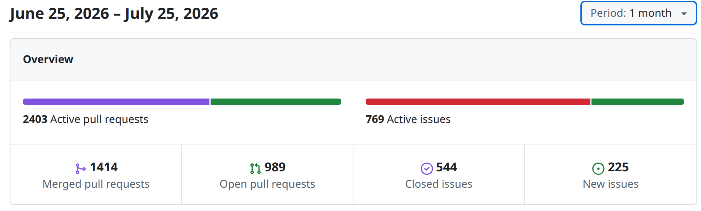
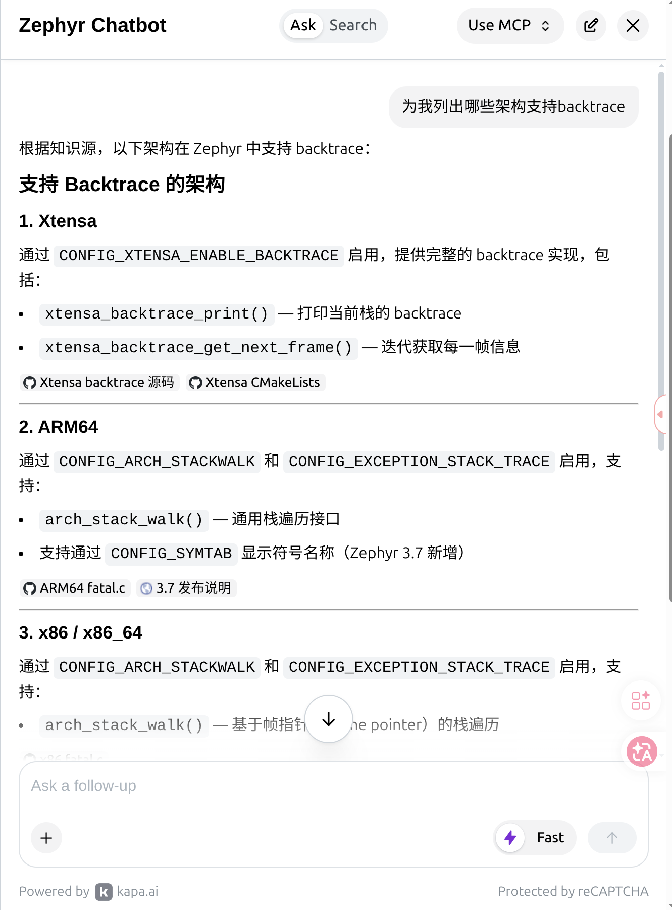
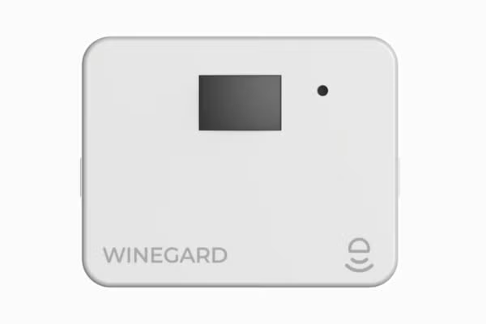
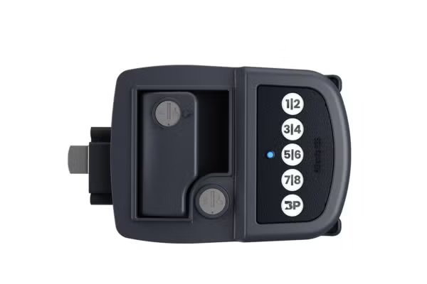
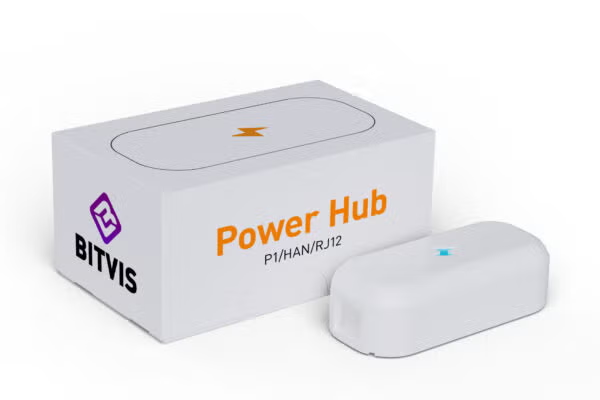

# Zephyr 爱好者月刊（第 19 期 202607）

这里记录 Zephyr 最新的消息和值得分享的内容，每月最后一周发布。

本杂志开源（GitHub：[lgl88911/Zephyr_Fans_Monthly](https://github.com/lgl88911/Zephyr_Fans_Monthly)），欢迎提交 issue、投稿或推荐 Zephyr 相关内容。

## 项目数据



不包括合并，407 位作者向主分支推送了 3156 次提交，向所有分支推送了 3658 次提交。
在主分支上，共有 8094 个文件发生了变化，新增了 220573 行，删除了 44263 行。


近期动向：
- [添加 devfs](https://github.com/zephyrproject-rtos/zephyr/pull/110902) 目前对实施的争议比较大
- [导入通用硬件信号多路复用](https://github.com/zephyrproject-rtos/zephyr/pull/112088)
- [添加通用的引用计数器](https://github.com/zephyrproject-rtos/zephyr/issues/112166)
- [头文件保护宏一致性规范提案](https://github.com/zephyrproject-rtos/zephyr/issues/111768)
- [west 支持 devicetree 命令](https://github.com/zephyrproject-rtos/zephyr/pull/112680)
- [减少 HAL 使用提案](https://github.com/zephyrproject-rtos/zephyr/pull/108088)
- [BT Host 架构重构简化线程模型](https://github.com/zephyrproject-rtos/zephyr/issues/113007)
- [导入模拟开关子系统](https://github.com/zephyrproject-rtos/zephyr/pull/110101)
- [重构初始化等级：废弃 PRE_KERNEL_1/2 与 SMP 层级，转为 Devicetree 自动排序](https://github.com/zephyrproject-rtos/zephyr/pull/112934)
- [UFS 驱动支持](https://github.com/zephyrproject-rtos/zephyr/pull/93528)
- [ESMF 实现](https://github.com/zephyrproject-rtos/zephyr/pull/113109)
- [SDIO 子系统重构](https://github.com/zephyrproject-rtos/zephyr/pull/113116)
- [移除不完善的 SiP](https://github.com/zephyrproject-rtos/zephyr/pull/113468)
- [dwc_mac 支持多播过滤](https://github.com/zephyrproject-rtos/zephyr/pull/113235)
- [添加 NFC 驱动框架和 rc522 驱动](https://github.com/zephyrproject-rtos/zephyr/pull/113367)
- [添加 Fast GPIO API](https://github.com/zephyrproject-rtos/zephyr/pull/110787)
- [添加 RFID 驱动 CR95HF](https://github.com/zephyrproject-rtos/zephyr/pull/91254)

## 新闻与活动

本月无重大新闻和活动发生，大多数是对往期见面会的总结。

## 文摘与观点

1、[RTOS 和嵌入式 Linux 选择决策](https://embeddedbits.org/rtos-vs-embedded-linux-in-2026-where-zephyr-fits-and-where-linux-still-wins/)

文章剖析了 2026 年 RTOS 与嵌入式 Linux 的选型逻辑演变，提出"按内存容量划分"的决策模式已失效。提出：**Zephyr** 为代表的现代 RTOS 突破资源受限系统的边界，凭借 TLS 1.3、Bluetooth Mesh、PSA 认证安全架构及 West/CMake/Kconfig 现代工具链，成为能独立支撑复杂 IoT 联网设备的完整操作系统；而嵌入式 Linux 通过 PREEMPT_RT 将实时延迟压缩至 50-200 微秒，蚕食了传统 RTOS 的软实时领地。

**Zephyr** 的三重优势：
- 确定性调度（<10μs 延迟）
- 极小内存占用（256KB Flash / 64KB RAM 级）
- 业界领先的 BLE 与低功耗实现

该优势使 Zephyr 在智能传感器、可穿戴设备、医疗及工业控制领域成为首选。然而，当产品需要 AI 推理、容器化、十年以上 LTS 支持或丰富图形界面时，Linux 仍不可替代。

最终结论提出**混合架构**的必然趋势：以 AMP 模式将 Linux 部署于 Cortex-A 核心处理高层任务，Zephyr 运行于 Cortex-M 核心保障硬实时与安全关键操作，通过 RPMsg/OpenAMP 协同，实现灵活性与确定性的最优平衡，这也是下一代嵌入式系统的主流范式。

**决策框架**：
- 选 **Zephyr/RTOS**：确定性时序、最小资源、快速启动、低功耗
- 选**嵌入式 Linux**：丰富软件生态、高级网络、图形界面、长期可维护性
- **混合架构**：下一代嵌入式系统的首选方案——Linux 处理高层应用逻辑，Zephyr 在专用微控制器上执行时间关键任务

2、[FreeRTOS 与 Zephyr 背后的嵌入式开发范式转移](https://zhuanlan.zhihu.com/p/2057570308454981946)

现代 RTOS 的演进是从"可移植内核"向"可复现系统工程"的范式转移。FreeRTOS 以克制的设计成为可靠的内核，但其平台化依赖外部系统（如 ESP-IDF），工程知识散落，换芯片成本高。Zephyr 则将平台工程内化为 RTOS 本体：west.yml 实现多仓库版本复现，module 机制统一外部组件的构建与配置，devicetree 作为结构化构建输入替代分散的硬件定义，Kconfig 系统化管理软件能力，Twister 矩阵化验证多平台组合，LTS 与安全流程制度化长期维护。Nordic nRF Connect SDK 基于 Zephyr 的发行版实践，展现了这种"硬件差异数据化、功能选择可追踪、组件版本可复现、测试矩阵自动化、安全修复可回溯"的完整工程闭环。

文章最终指出：当产品跨越多板、多芯片、多协议栈与多年周期时，工程问题的权重将压过内核问题——这是 Zephyr 以平台工程重构嵌入式开发的价值所在。

3、[Médiane Système 将 Zephyr RTOS 纳为核心技术的演进历程](https://medianesysteme.com/en/de-linnovation-interne-a-une-expertise-reconnue-notre-parcours-autour-de-zephyr/)

这篇文章讲述了嵌入式工程公司 Médiane Système 自 2023 年起将 Zephyr RTOS 纳为核心技术的演进历程：
- 核心优势：文章将 Zephyr 誉为"轻量级嵌入式 Linux"，看重其跨架构移植性（支持 ARM、RISC-V、ESP32）、丰富的网络栈（BLE、Wi-Fi、Thread）以及原生安全设计。
- 全栈开发能力：涵盖 Secure Boot 安全启动与内核加固、定制化 BSP 与驱动开发、工业协议（Modbus、OPC UA 等）集成，以及高硬实时性的业务应用开发。
- 实战案例：成功将一个包含 1,500 个源文件、20 个线程的复杂关键使命（Mission-critical）硬实时系统迁移至 Zephyr，且未牺牲性能。

该公司提供从前期需求规划到后期长期维护（MCO/MCS）的全生命周期服务，展现了 Zephyr 在工业级项目中的成熟落地能力。

4、招聘信息

https://careers.hitachi.com/jobs/17774290-automotive-engineer-linux-slash-zephyr

日立数字服务越南有限公司于 2026 年 7 月发布的 **汽车嵌入式工程师（Linux/Zephyr）** 招聘信息

https://www.monster.com/job-openings/senior-principal-technical-solution-architect--1a82df5a-b449-4dfd-84a4-2db1f781f4b4

Cerence 招聘高级首席技术解决方案架构师，负责人形机器人软件架构，Zephyr RTOS 被列为"高度加分项"中的微控制器 RTOS 首选

https://www.jobijoba.co.uk/detail/92/77e98a0fd86dbfb0db4f766d677f890c

Filtronic plc 于 2026 年 7 月发布的招聘广告，招募**同时掌握嵌入式 Linux 与 Zephyr RTOS** 的高级工程师，主导 RF 通信产品的软件架构

这三则招聘信息释放了一个极为明确的信号：Zephyr 正在从消费级 IoT 的"轻量备选项"，正式跃升为汽车、具身智能与高频通信等高壁垒领域的"工业级核心技术栈"。

## 技术

1、[Zephyr 嵌入式应用模糊测试技术探索](https://www.zephyrproject.org/exploring-fuzzing-for-zephyr-applications-with-libfuzzer-and-afl/)

这篇文章总结了 Analog Devices 的工程师 Jayashree Srinivasan 在 Open Source Summit & Embedded Linux Conference 上的演讲《Fuzzing Zephyr Apps: Struggles of Dynamic Analysis on Embedded Applications》，主要讨论了在 Zephyr RTOS 嵌入式应用中引入模糊测试（Fuzzing）的挑战、现状以及基于 libFuzzer 和 AFL++ 的实践探索。

模糊测试基础概念

| 特性 | 说明 |
| ---- | ---- |
| **定义** | 运行时测试技术，向软件输入畸形、随机或意外数据 |
| **监测目标** | 崩溃、内存泄漏、异常行为 |
| **与静态分析对比** | 仅测试已执行代码路径，假阳性更少，能发现特定运行时条件触发的问题 |

相比通用 PC 软件，嵌入式应用的模糊测试要困难得多：
- 硬件与架构异构：架构、外设和协议纷繁复杂，输入依赖寄存器状态、传感器、硬件中断等。
- 执行与建模成本高：软硬件高度绑定，需要建模 CPU、内存、中断和外设；插桩（Instrumentation）生成的二进制文件体积和算力开销大，受限于受限设备。
- 崩溃检测与状态重置困难：嵌入式崩溃常表现为卡死、死锁或进入错误中断，而非明确的退出信号；测试用例之间难以快速重置内存和寄存器状态。

现有方案对比

| 方案 | 原理 | 优势 | 劣势 |
| ---- | ---- | ---- | ---- |
| **硬件在环（Hardware-in-the-loop）** | 真实硬件参与测试 | 保真度最高 | 难以扩展 |
| **全平台仿真（Full-platform emulation）** | 虚拟环境运行 | 完整系统模拟 | 建模工作量巨大 |
| **重托管（Rehosting）** | 仿真处理器 + 软件模型替代硬件交互 | 平衡方案 | 需抽象硬件层 |
| **HALucinator** | 用高层软件模型或 Python 处理程序替换 HAL 函数 | 聚焦抽象层 | 特定场景适用 |
| **单 RTOS 任务模糊测试** | 不重托管整个系统，仅模糊单个任务 | 轻量级 | 覆盖范围有限 |

Zephyr 现有的 Fuzzing 支持：Zephyr 内置了对 libFuzzer（LLVM 体系中的覆盖率引导模糊测试工具）的支持：
- 优势：速度快，非常适合 API 级别测试、解析器（Parser）、加密库、网络协议栈以及持续集成（CI）阶段的快速验证。
- 局限：由于 libFuzzer 与目标程序运行在同一个进程中，共享内存空间，一旦目标代码发生 Crash，整个模糊测试进程也会跟着中断退出。

为了克服单进程限制，研究团队探索了将 AFL++ 集成到 Zephyr 的 native_sim（原生模拟器）平台：
- 解耦与隔离：AFL++ 采用主从/多进程架构，目标崩溃不会影响 Fuzzer 本身。
- 实践验证：团队使用 AFL++ 工具链编译 Zephyr 应用，成功检测到了故意注入的崩溃，并将引发 Crash 的输入保存，随后可通过 GDB 重新加载与调试。
- 当前进展：相关 RFC 和 Pull Request 已提交至社区，目前仍在进一步重构和完善阶段。

未来展望与社区规划
- 拓展平台支持：从 native_sim 扩展到基于 POSIX 和 QEMU 的模拟平台。
- 组件与上下文优化：探索可复用的外设软件模型，以及针对特定 RTOS 任务（Task-specific）的模糊测试上下文。
- 社区协作：与 Zephyr 安全工作组（Security Working Group）合作，将 AFL++ 作为 libFuzzer 的补充，支持更长时间、更深层次的应用级测试。

2、[SynapticOS 推理优先的开源运行时系统](https://arxiv.org/pdf/2607.12606)

一篇关于 SynapticOS 的论文。SynapticOS 是基于 Zephyr RTOS 构建的开源"推理优先"嵌入式运行时架构。针对传统 Zephyr + TFLM 组合仅将 AI 作为应用层库、导致内存碎片与缺乏硬件状态管理的痛点，SynapticOS 深度整合 Zephyr 底层：在其上实现了 16 字节 DMA 对齐的零碎片张量内存分配器（154 周期极速分配）、统一的 NPU 4 状态 HAL 以及模型生命周期注册表。在 NXP MCXN947 开发板上，包含 Zephyr Shell 与 128KB 内存池的完整固件仅占 67KB Flash，完美拓展了 Zephyr 对 TinyML 的原生支持能力。

3、[从 C 到 C++：Zephyr RTOS 嵌入式 Web 服务器重构实践](https://derekmolloy.ie/the-zephyr-web-server-now-in-c-classes-for-embedded-hardware/)

本文介绍了在 Zephyr RTOS 上使用 C++ 重构嵌入式 Web 服务器的实践（基于 Seeed XIAO nRF52840 开发板与 Thread 协议网络）。

Zephyr 虽然由 C 语言编写，但原生支持 C++ 应用开发。只需在 Kconfig 中设置 CONFIG_CPP=y，构建系统即可自动处理 C++ 编译与全局构造函数调用。

将 Zephyr 底层的 C API（如 GPIO、Sensor API）和硬件（RGB LED、nRF52840 芯片内置温度传感器）封装为 C++ 类。在不增加底层新 API 的前提下，消除了 C 语言版本中的全局变量，大幅提升了代码模块化与安全性。

遵循 Zephyr 的优化策略，默认关闭 C++ 异常（Exceptions）与 RTTI，仅增加少量 Flash 开销，兼顾面向对象设计与嵌入式系统的轻量需求。

## 课程与教程

1、[EmbeddedFun 提供的 Zephyr RTOS 入门导引](https://embeddedfun.org/docs/zephyr-training/how-to-start/)

该教程是 EmbeddedFun 提供的 Zephyr RTOS 入门指引。教程由浅入深分为基础、进阶、高级和测试四大板块，涵盖设备树（Devicetree）、Kconfig 配置、外设驱动开发、RTOS 线程同步、蓝牙/Wi-Fi 通信、OTA 升级及 `native_sim` 固件测试等核心内容。

2、[从 FreeRTOS 到 Zephyr：嵌入式开发者的实践迁移指南](https://www.zephyrproject.org/from-freertos-to-zephyr-a-practical-migration-guide-for-embedded-developers-jacob-beningo-beningo-embedded-group/)

本文总结了 Jacob Beningo 在 Embedded Linux Conference 上关于将嵌入式项目从 FreeRTOS 迁移至 Zephyr 的实用指南，指出迁移并非简单的 API 一对一替换，而是涉及内核机制、现代构建系统（CMake/West）及设备树（Devicetree）硬件描述模式的系统性转变；文章重点对比了任务与线程创建、栈空间定义、中断处理，以及颠倒的优先级逻辑（FreeRTOS 中 0 为最低优先级，而 Zephyr 中 0 为最高抢占优先级）等易错陷阱，提出"分析架构、引入抽象层、适配构建系统、映射内核对象、验证行为"的标准迁移路径。

## 工具

1、[基于 Zephyr Sensor Anomalies 库的嵌入式设备异常检测方案](https://www.zephyrproject.org/anomaly-detection-in-embedded-devices-using-the-zephyr-sensor-anomalies-library/)

Antmicro 推出的 Zephyr Sensor Anomalies 库为运行 Zephyr RTOS 的微控制器（MCU）提供了一套易用的传感器异常检测方案，它能在后台独立线程中自动采集传感器数据并运行机器学习模型推理，触发异常时立即执行用户自定义回调函数而不干扰主程序运行，同时结合 Kenning 框架的时间维度评估指标及 Renode 仿真工具，简化并优化嵌入式边缘端 AI 模型的开发、部署与实时测试评估流程。

2、[LVGL Pro Editor v2.0+ 原生支持 Zephyr RTOS](https://lvgl.io/docs/pro/integration/zephyr)

LVGL Pro Editor 开始无缝集成至 Zephyr 实时操作系统（RTOS）的完整技术架构与操作路径，其生成的代码可以不做任何修改导入到 Zephyr 中使用。

我曾经在去年做过类似的事情[LVGL Pro 使用指南[03]-XML 编辑器-创建项目与 Zephyr 应用整合](https://lgl88911.pages.dev/lvgl/lvgl-pro%E4%BD%BF%E7%94%A8%E6%8C%87%E5%8D%9703-xml%E7%BC%96%E8%BE%91%E5%99%A8-%E5%88%9B%E5%BB%BA%E9%A1%B9%E7%9B%AE/)，现在官方已经默认支持，可见 Zephyr 的影响力。

3、[Zephyr 文档 AI 助手——**Kapa.ai**](https://docs.zephyrproject.org/latest/develop/tools/kapa_ai.html)

**Kapa.ai** 是集成在 Zephyr 文档网站中的 AI 助手，专门为 Zephyr 项目提供智能化文档查询和知识服务，打破了语言的屏障，可以直接用中文查询文档。
- 训练数据来源：Zephyr 自身文档、源代码、GitHub 活动记录
- 回答问题时引用具体的文档页面和资源来源

| 功能 | 说明 |
| ---- | ---- |
| **聊天机器人（Chatbot）** | 页面底部按钮或 Ctrl+K/Cmd+K 快捷键唤起，侧边栏交互 |
| **AI 驱动搜索** | 通过搜索框齿轮图标切换，替代传统关键词搜索 |
| **MCP 服务器** | 对外暴露 Zephyr 知识库，供外部 AI 助手和 IDE 调用 |

| 来源 | 具体内容 | 刷新频率 |
| ---- | ---- | ---- |
| **源代码** | `zephyrproject-rtos/zephyr` 仓库（排除 `boards/` 和 `doc/`）；C、Markdown、Python、文本文件 | 每小时 |
| **API 参考文档** | `docs.zephyrproject.org/latest/doxygen/html/index.html` | 每日 |
| **设备树绑定** | `docs.zephyrproject.org/latest/build/dts/api/bindings.html` | 每日 |
| **主文档** | `docs.zephyrproject.org/latest/`（排除 API 参考和设备树绑定部分） | 每日 |
| **项目 Wiki** | `github.com/zephyrproject-rtos/zephyr/wiki` | 每日 |
| **GitHub Issues** | 近 6 个月的 issues | 每 5 分钟 |
| **GitHub PRs** | 近 6 个月 PRs（排除未合并关闭的） | 每 10 分钟 |




## 使用 Zephyr 的产品

1、[RV Halo Smart Sensors 房车的智能监控系统](https://www.zephyrproject.org/portfolio/rv-halo-smart-sensors/)

Winegard 公司推出的房车智能传感器包（RV Halo Smart Sensors）包含运动、水浸、温湿度、门窗状态四种蓝牙传感器，通过网关实现远程监控与告警，专为房车场景设计。

利用 Zephyr 的设备驱动与配置系统，使四种硬件各异的传感器共享统一固件代码库，各变体仅按需启用特定模块，从而大幅降低开发复杂度、保证行为一致性、提升可维护性。此外，Zephyr 现代嵌入式生态为平台提供了连接性、安全性与长期演进能力，支持新传感器类型无缝扩展。



2、[Bauer NE 蓝牙智能锁](https://www.zephyrproject.org/portfolio/bauer-ne/)

搭载 Zephyr 实时操作系统（RTOS）的 Bauer NE 蓝牙智能门锁，专为房车（RV）门锁升级与安全防护而设计。该门锁将现代无钥匙体验与传统安全性相结合，内置蓝牙模块，用户可通过 Bauer 手机应用将智能手机变为数字钥匙进行开锁与管理。除手机蓝牙解锁外，它还配备了带背光的耐用数字按键（支持 PIN 码开门）以及传统机械钥匙作为备用开锁手段。



3、[Bitvis Power Hub 智能电表读取设备](https://www.zephyrproject.org/portfolio/bitvis-ab-power-hub/)

一款运行于 Zephyr RTOS 操作系统之上的智能 HAN 端口电表读取设备。该产品支持通过蓝牙与 2.4 GHz Wi-Fi 进行便捷的无线配网，能够实时流式传输电表数据，将用电情况精准推送至用户端。在功能层面，它具备实时用电监测、高峰用电预警以及自动负载均衡等核心优势。Bitvis Power Hub 充分体现了 Zephyr 操作系统在低功耗、高可靠性智能硬件中的优异性能，为家庭与企业用户提供了高效、低成本的智能化用能管理解决方案。



## Zephyr 每月小知识

按照 Zephyr 目录下 `west.yml` 执行 `west update` 抓取各仓库代码时会抓到所有的历史 commit，为了减少占用磁盘空间，可以使用 clone-depth 字段来创建浅克隆（shallow clone），从而只抓取最近的几个提交，而不拉取完整的历史记录：

将 `clone-depth: 1` 设置为项目属性，即可只获取最新的一个提交：
```yaml
manifest:
  remotes:
    - name: zephyrproject-rtos
      url-base: https://github.com/zephyrproject-rtos
  projects:
    - name: zephyr
      remote: zephyrproject-rtos
      revision: main
      clone-depth: 1
      import: true
```
这样 `west update` 时只会拉取 main 分支的最新提交，大幅减少网络传输和本地存储占用。

`clone-depth` 的值必须是正整数。`clone-depth` 只能与 branch 或 tag 类型的 revision 配合使用，不能用于 SHA commit。
