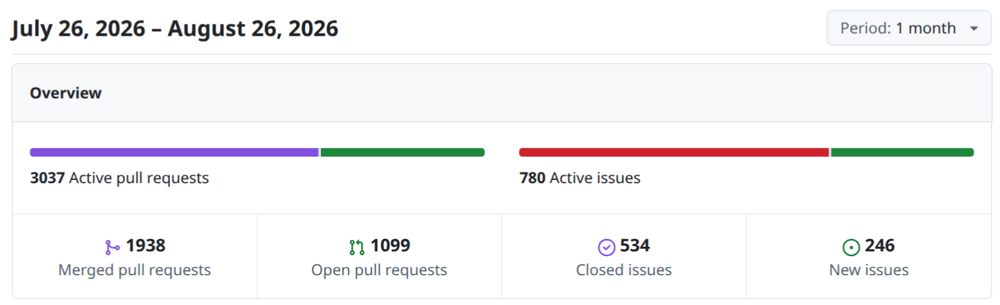
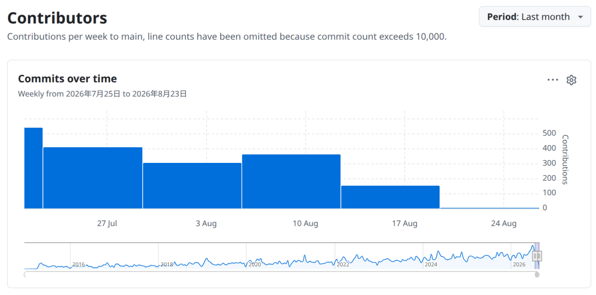
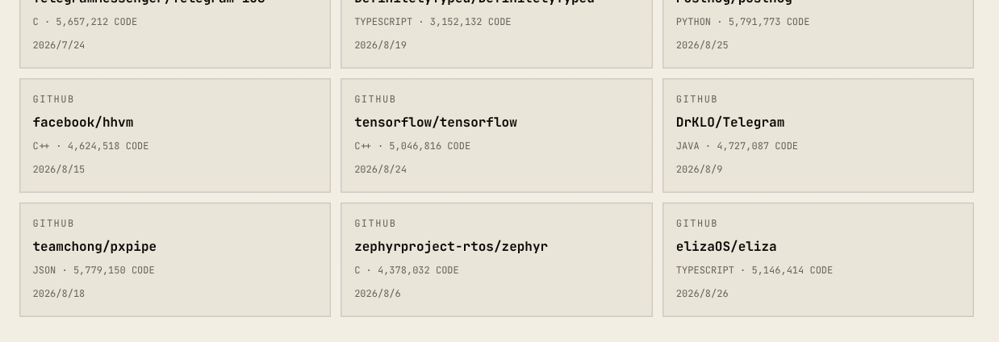

# Zephyr 爱好者月刊（第 20 期 202608）

这里记录 Zephyr 最新的消息和值得分享的内容，每月最后一周发布。

本杂志开源（GitHub：[lgl88911/Zephyr_Fans_Monthly](https://github.com/lgl88911/Zephyr_Fans_Monthly)），欢迎提交 issue、投稿或推荐 Zephyr 相关内容。

## 项目数据



不包括合并，505 位作者向主分支推送了 3581 次提交，向所有分支推送了 3990 次提交。
在主分支上，共有 9615 个文件发生了变化，新增了 289375 行，删除了 57222 行。



近期动向：
- [添加摩托罗拉 m68k 架构](https://github.com/zephyrproject-rtos/zephyr/issues/114672)
- [添加图形加速器子系统](https://github.com/zephyrproject-rtos/zephyr/pull/113724)
- [增加细粒度断言机制 ZASSERT](https://github.com/zephyrproject-rtos/zephyr/pull/112756)
- [增加 ADC 阈值 API](https://github.com/zephyrproject-rtos/zephyr/pull/113658)
- [移除不完善的 Sip](https://github.com/zephyrproject-rtos/zephyr/issues/113468)
- [32 位目标上 64 位 MMIO 访问语义定义](https://github.com/zephyrproject-rtos/zephyr/pull/114431)
- [添加 UWB 子系统](https://github.com/zephyrproject-rtos/zephyr/pull/112599)
- [ring_buffer 零拷贝 API 重构](https://github.com/zephyrproject-rtos/zephyr/pull/106290)
- [导入可移植 IRQ 挂起状态与活跃追踪 API](https://github.com/zephyrproject-rtos/zephyr/pull/116360)
- [I2S 子系统 RTIO 化重构](https://github.com/zephyrproject-rtos/zephyr/pull/115440)
- [默认关闭编译时宏展开追踪](https://github.com/zephyrproject-rtos/zephyr/pull/117223)
- [PSE（Power Sourcing Equipment）子系统的架构提案](https://github.com/zephyrproject-rtos/zephyr/issues/112263)

## 新闻与活动

1、[Zephyr 4.4.2 发布](https://github.com/zephyrproject-rtos/zephyr/releases/tag/v4.4.2)

Zephyr 4.4.2 可以说是安全维护版本，虽定位为 4.4.1 的 bugfix 更新，实则是一次大规模安全漏洞集中修复行动。该版本修复超过 80 个 CVE，其中已公开的 35 个涵盖除零错误、路径遍历、NULL 指针解引用、use-after-free、越界读写、死锁 DoS 等典型内存安全与并发缺陷，影响范围遍及蓝牙协议栈（Classic 与 LE Audio）、网络核心（含 WireGuard/HTTP/DNS）、内核用户空间隔离（`CONFIG_USERSPACE`）、USB 设备/主机栈及多类硬件驱动。

2、[GD 成为 Zephyr 的银牌会员](https://www.zephyrproject.org/project-members/)

上个月才在 GitHub 上看到 GD 的人询问如何与社区紧密合作，这个月兆易创新（GigaDevice）就成为了 Zephyr 的银牌会员。


3、[Zephyr 社区奖项——庆祝十年开源贡献](https://www.zephyrproject.org/introducing-the-zephyr-community-awards-celebrating-10-years-of-contribution/)

为庆祝 Zephyr 项目成立 10 周年，Zephyr 社区推出了全新的“Zephyr 社区奖项”（Zephyr Community Awards）计划。该奖项旨在表彰十年来推动嵌入式系统与物联网开源创新的贡献者、文档编写者、布道者及幕后英雄。奖项涵盖卓越成就奖、顶级代码贡献者、文档卓越奖、幕后工作者奖等六大类别。颁奖典礼定于 2026 年 10 月 7 日至 9 日在捷克布拉格举行的 Zephyr 开发者峰会上现场举行，以此致敬构建和维护该生态系统的核心群体。

如果觉得我产出的 Zephyr 内容对你有帮助，**请为我推荐**，谢谢！

**推荐地址：https://bit.ly/4fiS6ig ，推荐填写信息：**
- Nominee's full name：**GuoLiang Li**
- Nominee's affiliation: **independent**
- Nominee's email address : **lgl88911@163.com**
- Award category you are nominating for: **Ecosystem Amplifier Award**
- Nominee's GitHub handle: **lgl88911**
- Nomination statement : **Produced 300+ technical articles in Chinese on Zephyr, significantly enriching the Chinese Zephyr ecosystem and lowering the barrier to entry. Curated the Zephyr Enthusiast Monthly to expand Zephyr's reach and influence in the Chinese-speaking community.**
- Supporting links：
  - Blog: https://lgl88911.pages.dev/all/
  - Monthly：https://github.com/lgl88911/Zephyr_Fans_Monthly
  - PR: https://github.com/zephyrproject-rtos/zephyr/pulls/lgl88911

4、[Opportunity Open Source Conference 4.0 峰会活动](https://www.zephyrproject.org/event/opportunity-open-source-conference-4-0/)

8 月 28 - 30 日，"Opportunity Open Source Conference 4.0" 是一场聚焦开源软件与技术的综合性开发者盛会，涵盖技术演讲、研讨会及社区交流活动。活动特别设立了 **Zephyr 专属分论坛（Zephyr Track）**，集中展示 Zephyr RTOS 作为轻量级实时操作系统在物联网（IoT）及资源受限设备中的作用。该分论坛帮助与会者深入了解 Zephyr 的最新架构、与社区建立联系，并探讨实践案例与贡献路径，展现了 Zephyr 在推动开源嵌入式生态和培养开发者能力方面的关键影响力。

5、[Zephyr 社区与 Embedded World North America 2026 展会活动](https://www.zephyrproject.org/event/embedded-world-north-america-2026/)

Zephyr Project 社区将于 2026 年 9 月 22 日至 24 日参加在加利福尼亚州阿纳海姆举行的 **Embedded World North America 2026** 展会。本次活动预计吸引超过 5,000 名专业观众及 250 家参展商。

Zephyr 在展会期间将设立技术分会与现场演示区，展会将全方位展示 Zephyr 在成熟度、AI 工具链融合及航天级高可靠性应用上的最新进展。重点呈现三大内容：
- Jacob Beningo 主持的 **“AI 辅助 Zephyr BSP 开发”** 手把手实操（演示如何在 3 小时内完成板级支持包构建）
- Linux 基金会 Kate Stewart 带来的 **“Zephyr 成立十周年生态演进”** 主旨演讲
- 探讨 **“Zephyr 登月应用”** 中的硬件、仿真与硬件在环（HIL）测试架构。

6、[Zephyr 亮相 ROSCon Global 2026](https://www.zephyrproject.org/event/zephyr-project-at-roscon-global-2026/)

Zephyr 社区将在 9 月 24 日参加机器人领域的顶级盛会 ROSCon Global 2026。Zephyr 在本次大会上将重点呈现其与 micro-ROS 的深度集成方案。展示内容涵盖：
- 如何在资源受限的 MCU 上高效运行 micro-ROS 节点
- 利用 Zephyr 的原生通信协议栈（如 Ethernet、CAN-FD、USB）实现与上层 ROS 2 Graph 的高实时/低延迟通信
- 借助 Zephyr 的 MPU/MMU 内存保护和确定性抢占调度保障机器人底层控制的安全性

7、Zephyr 9 月见面会

Zephyr 社区在 9 月份举行的见面会比较多
- https://www.zephyrproject.org/event/zephyr-project-meetup-september-15-2026-amsterdam/
- 2026 年 9 月 15 日，荷兰阿姆斯特丹 由 Zephyr 社区主办
- https://www.zephyrproject.org/event/zephyr-project-meetup-september-17-2026-zurich-switzerland/
- 2026 年 9 月 17 日，瑞士苏黎世 Zephyr 社区主办
- https://www.zephyrproject.org/event/zephyr-project-meetup-september-19-2026-buenos-aires-argentina/
- 2026 年 9 月 19 日，阿根廷布宜诺斯艾利斯
- https://www.zephyrproject.org/event/zephyr-project-workshop-meetup-sep-24-2026-stuttgart-germany/
- 2026 年 9 月 24 日，德国斯图加特

8、[Arduino Core on Zephyr 正式发布 **v0.90.0** 稳定版本](https://blog.arduino.cc/2026/07/29/arduino-core-on-zephyr-0-90-0-is-officially-stable-and-leaving-beta/)

**Arduino 官方博客**于 2026 年 7 月 29 日发布的重大技术公告文章，宣布 **Arduino Core on Zephyr**（在 Zephyr RTOS 上运行的 Arduino 核心适配层）正式发布 **v0.90.0** 稳定版本，并正式结束 Beta 测试阶段。

## 文摘与观点

1、[Zephyr 社区活动背景下的 Silicon Labs 技术面盘整分析](https://tradersunion.com/news/companies/show/2839884-silicon-labs-slips-0-07percent-today/)

这是首次在股票的技术面分析中看到公司提及 Zephyr 的开发者活动。

> Silicon Labs said it is supporting the Zephyr community by hosting the Zephyr Project Meetup in Hyderabad.

2、[Zephyr RTOS 诞生十年来从物联网设备走向太空卫星与边缘计算的演进历程](https://www.zephyrproject.org/from-smart-devices-to-satellites-ten-years-of-zephyr-rtos/)

本文回顾了 Zephyr RTOS 诞生十年来从物联网设备走向太空卫星与边缘计算的演进历程，展示了 Zephyr 在不同领域的能力：
- **项目概览与生态规模**：分析了 Zephyr 超 1000 款板卡支持、9000+ Fork 数以及跨越消费电子、工业和太空的出货规模。
- **安全与合规性（Safety & Security）**：探讨了 CVE 编号权威认证、自动化 SPDX SBOM 生成能力及 IEC 61508 功能安全认证进展。
- **硬件解耦与生命周期管理**：重点关注长达 5-10 年产品生命周期中，Zephyr 如何帮助开发者应对芯片停产和供应链风险。
- **极端场景（从低功耗追踪到卫星航天）**：列举了太阳能牧场追踪、野生动物监控以及卫星在轨运行中的低功耗管理实例。
- **AI 与边缘计算的交汇**：评估了 AI 代理在 Zephyr 社区代码审查与缺陷检测中的应用，以及“触发-计算”异构边缘智能架构。

3、[Zephyr 与汽车功能安全要求的契合点](https://www.zephyrproject.org/how-zephyr-aligns-with-automotive-functional-safety-requirements/)

本文探讨 Zephyr RTOS 在汽车功能安全领域的契合性与技术准备。汽车实时系统对低延迟、确定性性能、内存隔离及多任务可靠性有高度依赖。Zephyr 通过直接 ISR 交互、tickless 内核、基于 MPU/MMU 的内存保护、抢占式调度以及内置基准测试工具，在技术上满足了这些严苛要求。功能安全最终受 ISO 26262 等标准及 ASIL 等级的严格规范，Zephyr 正通过对 IEC 61508 基准的推进及严格的软件生命周期管理，持续向汽车等安全关键型工业应用迈进。

4、[Zephyr 如何简化前硅片（Pre-Silicon）与量产固件开发](https://www.zephyrproject.org/how-zephyr-simplified-pre-silicon-and-production-firmware-development/)

在芯片量产前进行 pre-silicon（前硅片）测试对提前发现设计缺陷非常重要。传统模式下往往需要维护两套平行的代码栈（用于仿真/FPGA 的专有 RTOS 栈与用于量产硬件的专有 RTOS 栈）。Qualcomm 的 PMIC 软件团队通过迁移到 Zephyr RTOS，成功实现了全开发周期单代码库的统一。借助 Zephyr 强大的跨平台硬件支持、Devicetree 与 Kconfig 配置解耦机制，以及 Twister 测试框架和 Pytest 自动化测试，不仅消除了繁琐的手动移植与同步工作，还大幅提升了早期测试的有效性，确保项目按时推进量产。

5、[借助现代软件生态系统简化嵌入式系统设计](https://www.embedded.com/simplifying-embedded-system-design-with-a-modern-software-ecosystem/)

随着嵌入式系统复杂度的爆发式增长，传统依赖厂家私有 HAL 库或裸机（Bare-Metal）架构的开发模式面临极高的时间成本与重构风险。本文以 ADI 的实际应用案例（远程油箱监测系统）为切入点，探讨如何通过现代化的开源软件生态与工具链来大幅简化嵌入式系统的开发流程，以及现代开源软件生态系统（以 Zephyr RTOS 为代表的现代化 RTOS）如何改变嵌入式工程范式。重点剖析了"代码复用与模块化"、"设备树（Devicetree）解耦"、"工具链自动化与测试"以及"安全与长期可维护性"四大维度。通过引入统一的软件抽象层、声明式硬件配置和持续集成（CI/CD）机制，现代生态不仅显著降低了跨芯片平台的移植门槛，还极大地加快了产品从原型验证到量产出货（Time-to-Market）的全生命周期进程。

6、[Zephyr 成了巨型库](https://octocounts.com/hall-of-monoliths)

**OctoCounts** 是为 **GitHub 开发者** 设计的数据统计与排行榜工具。通过调用 GitHub API，对用户或组织的开源贡献数据进行深度的代码行数（Lines of Code, LOC）分析与排行榜展示。Zephyr 已经进入巨型库的首页，排名第 35，排名第一的是 Linux。


7、[RTOS效能对比](https://www.beningo.com/rtos-performance-report/)

该报告由嵌入式系统独立咨询机构 Beningo Embedded Group 出品，共评估和对比了 8 款主流的实时操作系统（RTOS）：
- Zephyr RTOS（测试版本 v4.4.1）
- FreeRTOS（测试版本 v11.3.0）
- Eclipse ThreadX（测试版本 v6.5.1）
- PX5 RTOS（测试版本 v5.3.1）
- NuttX（测试版本 v12.13.0）
- Arm Keil RTX5（测试版本 v5.9.1）
- RT-Thread（测试版本 v5.2.2）
- Micrium µC/OS-III（测试版本 v3.08.02）

Zephyr RTOS 综合优缺点总结：
- 主要优势
  - 抢占调度与 IPC 性能顶尖：抢占式调度（89.6%）和信号量同步（91.2%）接近商业级 PX5，吞吐量约为 FreeRTOS 的 2 倍。
  - 极其出色的实时确定性：中断调度延迟虽非最短，但其中位数（5.16 µs）与 99‰ 最坏情况（5.162 µs）的抖动仅有 2 ns，可预测性极佳。
  - 内存优化显著：借助改进的内存块（Slab）管理与 picolibc 配合，Flash 占用极小，近两年内存分配性能提升了 378%。
- 主要不足
  - 中断起始延迟偏高：因使用统一软件 ISR 向量表，硬件中断响应延迟为 748 ns，远高于 FreeRTOS（325 ns）和 PX5（225 ns）。
  - 协作式调度性能一般：在非抢占式/协作式调度测试中仅达最高性能的 54.7%，落后于 FreeRTOS 和 ThreadX。
  - 安全机制对性能影响大：开启 MPU（内存保护单元）后，线程上下文切换的性能降幅高达 48.5%。

8、招聘信息

https://jobs.siemens.com/pt_PT/externaljobs/JobDetail/516176

西门子医疗招聘 Zephyr 产品软件开发者，聚焦于医疗实时表面成像与运动管理平台的边缘计算软件开发。在 Zephyr 平台整合实时表面成像、计算机视觉与智能设备集成技术，通过摄像头技术与高级图像处理算法，为临床提供精确、高效、以患者为中心的治疗方案。

https://www.jobleads.com/us/job/zephyr-rtos-architect-ecosystem-leader--jasper--e3c3ad9ce5fc42063b2219414f261faa7

Microchip 招聘 **Zephyr RTOS 架构师与生态负责人**，推动 Zephyr 贯穿公司 MCU/MPU/连接/安全等全产品线，并作为 Microchip 技术代表深度参与 Zephyr Project 及 Linux Foundation 上游社区。

https://careers.amd.com/careers-home/jobs/88585?lang=en-us

AMD 招聘网络与存储固件开发工程师，Zephyr RTOS 被明确列为加分项。

## 技术

1、[Zephyr BLE 纽扣电池设备功耗优化](https://www.embeddedsoft.net/zephyr-ble-power-optimization-for-coin-cell-devices/)

本文针对 Zephyr 在 STM32WB55 双核平台上 BLE 纽扣电池应用，指出默认配置下睡眠电流高达 10 - 20 µA（远超数据手册 ~1.8 µA STOP2 典型值）的原因并给出解决方案。
- 主要问题：CLK48 HSEM 信号量死锁：Zephyr 时钟驱动永久锁定该信号量以防止 CPU2 关闭 RNG/USB 时钟，却未在 CPU1 睡眠时释放，导致 CPU2 外设持续耗电。修改 `clock_stm32_ll_common.c` 在进出 STOP2 时动态释放/获取 HSEM，可使系统接近数据手册功耗地板。
- 四项关键措施：
  - 调整广播参数让 BLE 控制器自主调度，避免主机频繁唤醒
  - Devicetree 配置 STOP2 状态与设备自动运行时 PM
  - BLE 5.2 LEPC 动态 TX 功率控制
  - 驱动层 `get/put_async` 精细外设电源管理

2、[PiZZa：将树莓派 Zero 转变为微控制器](https://dronebotworkshop.com/pizza-pi/)

**PiZZa** 是一个开源项目，在 Raspberry Pi Zero W/2W 上以 Zephyr 实时操作系统替代 Linux，并在其上运行 Arduino Core。

项目地址：https://github.com/jetpax/PiZZa

3、[开源鼠标固件 ZGM](https://github.com/Keychron/zgm)

ZGM 是 Keychron 基于 Zephyr RTOS 打造的开源游戏鼠标固件项目，目标是将键盘领域成熟的 QMK/ZMK 开源文化迁移至鼠标场景。采用模块化架构——传感器、按键、滚轮、灯光等驱动层完全解耦，兼顾硬件灵活性与代码可维护性；性能层面针对竞技需求优化输入延迟，同时原生支持有线/无线双模与电源管理。该项目是 Keychron 开源矩阵（QMK、ZMK、硬件设计）的自然延伸，体现出从"开源键盘"向"全品类开源外设"拓展的战略意图。

| 维度 | 具体内容 |
| ---- | ---- | ---- |
| **底层系统** | Zephyr RTOS，提供广泛的 MCU/外设支持、可扩展构建工具链、分层硬件抽象 |
| **架构设计** | 模块化驱动架构：传感器、按键、滚轮、灯光驱动解耦，可独立替换/扩展 |
| **性能优化** | 传感器轮询优化、精确的按键/点击处理、调校后的滚轮集成，面向竞技级低延迟 |
| **连接方式** | USB 有线与无线架构均支持，内置电池与电源管理 |

4、[ChromeOS 在 Zephyr 中实现动态硬件选择](https://www.zephyrproject.org/how-chromeos-uses-zephyr-for-dynamic-hardware-selection/)

在 ChromeOS 中，单个 Chromebook 参考板通常需跨多款商业产品使用，且面临供应链差异需要使用不同的替换器件（如传感器、USB-C 控制器、键盘布局等）。如果完全依赖 Zephyr 原生的静态 Devicetree 构建机制，会产生数以千计的固件镜像，从而给测试、签名、安全启动与版本管理带来极大的负担。为此，ChromeOS 团队制定了"每个参考板仅使用一个固件二进制文件"的目标。在不打破 Zephyr 设备模型的前提下，通过在底层之上构建一个运行时路由层，并在固件中打包一个可能用到的驱动超集（仅增加约 10 到 30 KB 的 Flash 开销），巧妙地实现了类似 Linux 的运行时硬件动态自适应能力。

5、[Gale — 形式化验证的 Zephyr RTOS 内核原语 Rust 移植](https://github.com/pulseengine/gale)

**Gale** 是面向 ASIL-D 安全关键嵌入式系统的、经形式化验证的 Zephyr RTOS 内核原语 Rust 重实现。该项目以 39 个 Verus 注解模块（805 项验证通过）为单一事实来源，通过 `verus-strip` 生成纯 Rust 代码，再经编译为裸机原生代码（gust）。验证采用三轨独立策略：
- Verus/SMT 直接证明 Rust 源码属性
- Rocq 对手写抽象模型进行无公理定理证明（含执行器"无丢失唤醒"的任意迹量化）；
- Lean 4 处理调度理论。

项目验证边界：针对源码而非编译产物，仅差分测试未证明等价。CI 涵盖 cargo 测试、Zephyr/QEMU 集成、Renode 三板仿真及形式化验证门控，由 Rivet 管理 ASPICE V 模型可追溯性。

6、[利用 Zephyr RTOS 优化 SoC 内存](https://modelnova.com/optimizing-memory-on-socs-with-zephyr-rtos/)

SoC 开发中，针对受限的 SRAM 和 Flash 进行内存优化对降低成本、控制功耗及提升系统确定性至关重要。该文章说明了 Zephyr RTOS 在 SoC 上进行内存优化的四大核心机制：
- **通过 Kconfig 实现代码与数据裁剪：**
	- **禁用无用组件：** 关闭不必要的内核特性（如 `CONFIG_MULTITHREADING=n` 单线程模式、`CONFIG_PRINTK=n` 或日志级别调优）。
	- **优化编译器选项：** 启用 `CONFIG_SIZE_OPTIMIZATIONS=y`（`-Os` 优化），并配合 `CONFIG_LINKER_ORPHAN_SECTION_ERROR=y` 精确控制链接段。
	- **子系统裁减：** 针对蓝牙（BLE）、网络栈或文件系统等重度依赖内存的模块，通过 Kconfig 深度自定义缓冲区大小和并发连接数。
- **利用 Devicetree（DTS）精确管理内存布局：**
	- **内存节点重映射：** 在 DTS `chosen` 节点中重新指定 `zephyr,sram` 或 `zephyr,flash` 的物理区域。
	- **保留内存区域（Reserved Memory）：** 通过 `reserved-memory` 节点预留特定 RAM 块，专供 DMA 传输、共享内存或硬件加速器使用，避免内核误分配。
- **线程堆栈与内核对象的内存管理：**
	- **静态堆栈分配：** 使用 `K_THREAD_STACK_DEFINE` 宏在编译期分配堆栈，利用编译器与链接器进行对齐，规避动态分配的不确定性。
	- **堆栈溢出检测与内存保护：** 结合 `CONFIG_HW_STACK_PROTECTION` 利用 MPU 警报页（Guard Pages）捕捉溢出，无需额外的动态检查逻辑。
	- **固定尺寸内存块（`k_mem_slab`）：** 替代传统通用动态内存堆（`k_malloc`），实现常数时间复杂度（ $O(1)$ ）的内存分配与零碎片管理。
- **高级内存分配与链接器段控制（Linker Scripts）：**
	- **CODE_IN_RAM 特性：** 使用 `__ramfunc` 属性将时间敏感的函数（如 ISR 或 Flash 擦写例程）直接装载至 RAM 中运行。
	- **分段优化：** 配合 Zephyr 的自定义链接器代码片段（Custom Linker Snippets），将只读数据（`.rodata`）或极少使用的初始化代码重定向至特定存储介质。

利用 Zephyr 原生内存分析工具，开发者可以在构建期与运行时精准掌控 SoC 内存分布：
- **构建期分析（Build-time Analysis）：** 利用 `west build -t rom_report` 和 `west build -t ram_report` 生成详细的符号级内存占用报告，精准定位占用空间最大的函数与全局变量。
- **运行时监控（Runtime Inspection）：** 启用 `CONFIG_STACK_USAGE=y` 和 Shell 命令（`kernel stacks`），实时监控各线程堆栈的高水位线（High-Water Mark），用于指导生产环境下的堆栈尺寸精简。

7、[Zephyr 低功耗优化](https://www.bermondseyelectronics.com/news/zephyr-os-and-power-optimisation/)

该文章深入剖析了 **Zephyr RTOS 的电源管理子系统（PM Subsystem）** 如何帮助开发者实现精细化功耗控制。与传统裸机或简单 RTOS 依赖手动睡眠调用不同，Zephyr 提供了 **系统级电源管理（System Power Management）**、**设备级电源管理（Device Power Management）** 以及 **空闲态低功耗（Tickless Idle）** 机制。通过根据线程调度需求自动将 CPU 置入深睡眠，并在外设空闲时动态切断电源或降低时钟。

## 课程与教程

1、[Zephyr Devicetree 覆写失效排查](https://www.embeddedsoft.net/fixing-zephyr-devicetree-overlays-that-silently-fail/)

在 Zephyr 开发中，设备树（Devicetree）覆写（overlay）失败往往不报错、不预警，导致固件行为与预期不符。这篇文章给出了调试方向：
- **未进入合并队列**：命名或路径规则不符
- **优先级被后续输入覆盖**：如板级修订、扩展板或代码片断
- **孤儿节点陷阱**：引用时漏掉取址符 `&` 导致在根下创建了无用子节点

调试方法：直接检查 Devicetree 的最终合并产物 `build/zephyr/zephyr.dts`，并在代码中使用 `BUILD_ASSERT` 进行编译期拦截。

2、[CLion Zephyr West 原生集成开发完全指南](https://www.jetbrains.com/help/clion/zephyr.html)

CLion 下使用 Zephyr West 原生集成开发完全指南，包括项目创建、代码编辑、编译、调试等。

3、[Zephyr DeviceTree 使用教程](https://derekmolloy.ie/the-zephyr-devicetree-an-interactive-demo/)

文章以 Seeed XIAO nRF52840 为平台，演示从安装工具链、读取板级 DeviceTree、理解三 cell GPIO 属性，到编写叠加层扩展外部 LED 与按钮的完整流程。

## Zephyr 每月小知识

Zephyr 下使用 ESP32 进行开发，当我们想进行 JTAG 调试时会希望 `west debug` 直接调用到 OpenOCD 并启动 GDB，但默认情况下是找不到 OpenOCD 的。这需要我们在编译时为其指定 OpenOCD 的路径。
```
west build -b <board> samples/hello_world -- -DCONFIG_DEBUG_THREAD_INFO=y -DOPENOCD=<path/to/bin/openocd> -DOPENOCD_DEFAULT_PATH=<path/to/openocd/share/openocd/scripts>
west debug
```