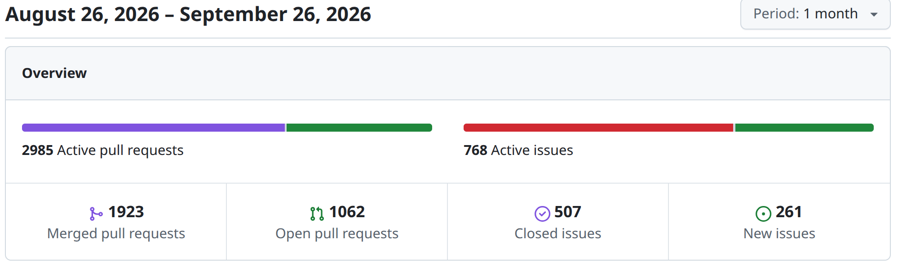
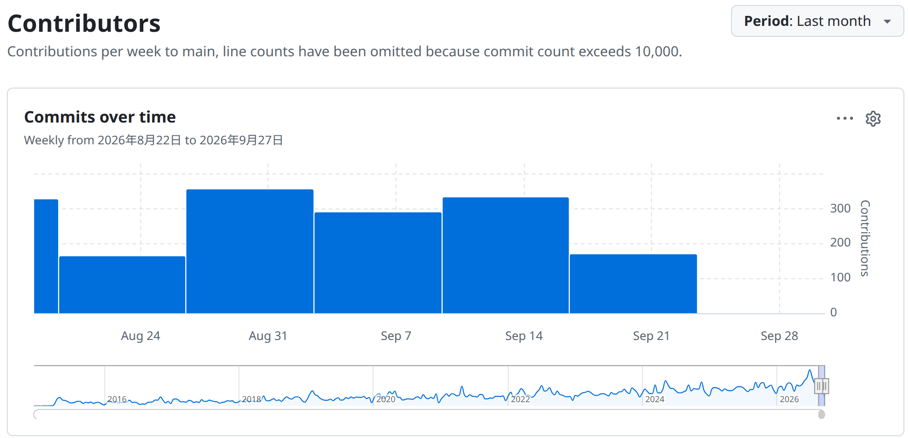
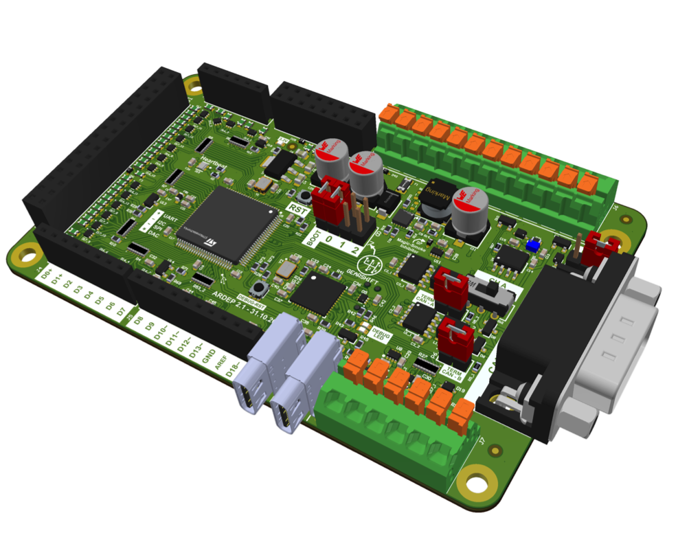
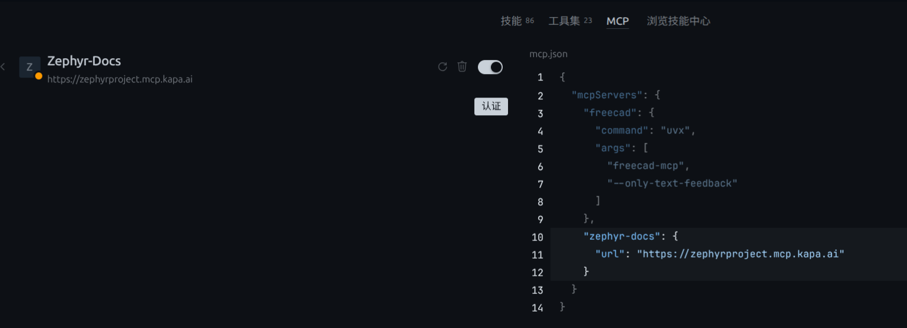
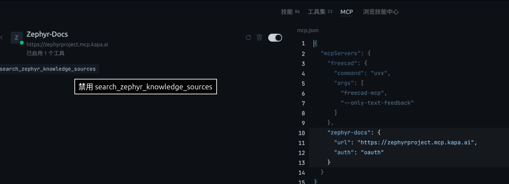

# Zephyr 爱好者月刊（第 20 期 202608）

这里记录 Zephyr 最新的消息和值得分享的内容，每月最后一周发布。

本杂志开源（GitHub：[lgl88911/Zephyr_Fans_Monthly](https://github.com/lgl88911/Zephyr_Fans_Monthly)），欢迎提交 issue、投稿或推荐 Zephyr 相关内容。

## 项目数据



不包括合并，542 位作者向主分支推送了 4098 次提交，向所有分支推送了 4515 次提交。
在主分支上，共有 10497 个文件发生了变化，新增了 330351 行，删除了 79275 行。



近期动向
- [k_futex_wait参数从int扩展为atomic_t](https://github.com/zephyrproject-rtos/zephyr/issues/117428)
- [添加图形加速器子系统](https://github.com/zephyrproject-rtos/zephyr/pull/113724)
- [移除不完善的 Sip](https://github.com/zephyrproject-rtos/zephyr/issues/113468)
- [Zephyr 硬件模型窄加载重构](https://github.com/zephyrproject-rtos/zephyr/pull/116699)
- [添加运行时板级身份/版本识别驱动类](https://github.com/zephyrproject-rtos/zephyr/issues/116600)
- [Modem chat 回调签名](http://github.com/zephyrproject-rtos/zephyr/issues/117672)
- [新增 TI CC1354P10 无线 MCU 支持](https://github.com/zephyrproject-rtos/zephyr/pull/116784)
- [增加时钟管理驱动](https://github.com/zephyrproject-rtos/zephyr/pull/89124)
- [步进电机新增 Getter 函数](https://github.com/zephyrproject-rtos/zephyr/issues/116452)
- [增加硬件 watchpoint 框架和 RISC-V 后端](https://github.com/zephyrproject-rtos/zephyr/pull/114300)
- [为 arm64 保存 boot FTD](https://github.com/zephyrproject-rtos/zephyr/pull/115346)
- [DT Bindings 的 API 类声明与编译期成员枚举](https://github.com/zephyrproject-rtos/zephyr/issues/116752)
- [添加root中断控制API](https://github.com/zephyrproject-rtos/zephyr/pull/117520)
- [NVMEM 子系统引入 Provider API 类以支持 PSA 安全存储后端](https://github.com/zephyrproject-rtos/zephyr/pull/117593)
- [RTIO安全取消机制](https://github.com/zephyrproject-rtos/zephyr/pull/114551)
- [增加JDI显示驱动](https://github.com/zephyrproject-rtos/zephyr/pull/114452)
- [支持 Espressif SoC 中断矩阵布局](https://github.com/zephyrproject-rtos/zephyr/pull/117493)
- [添加原生安全调用机制](https://github.com/zephyrproject-rtos/zephyr/pull/116520)
- [增加细粒度断言机制 ZASSERT](https://github.com/zephyrproject-rtos/zephyr/pull/112756)
- [新增fota_http库](https://github.com/zephyrproject-rtos/zephyr/pull/118420)
- [新增Applet（小程序）](https://github.com/zephyrproject-rtos/zephyr/pull/116666)


## 新闻与活动

1、[首届 Zephyr 维护者论坛](https://zephyrproject.org/event/zephyr-maintainers-forum/)

召集 Zephyr 生态的核心技术决策者参加线下工作会议，共同制定项目未来一年的战略技术路线图。该论坛是具有治理决策性质的闭门工作会议。会议不录制，强制线下参与以确保高效决策。注册需绑定 Open Source Summit Europe，早鸟价 €100。Renesas 提供差旅资助，申请截止 9 月 14 日。

论坛涵盖八大核心技术议题：硬件在环测试与 CI、安全合规（含 CRA 框架）、AI/LLM 融合、安全认证与 API 稳定性、电源与线程架构、构建系统与固件更新、跨平台扩展及高性能 MCU 优化。由 Nordic、Intel、Qualcomm、Google 等 12 位技术领袖引导讨论，并涉及发布规划与跨子系统协调。


2、[ZDS 2026将于2026年10月7日至9日在捷克布拉格举办](https://www.zephyrproject.org/event/zephyr-developer-summit-2026/)

ZDS2026 议题范围

| 议题方向    | 具体内容                                              |
| ------- | ------------------------------------------------- |
| 项目治理与规划 | 子系统规划（subsystem planning）、LTS政策（LTS policy）       |
| 安全体系    | 安全与漏洞管理（security and vulnerability management）    |
| 开发基础设施  | 开发者工具（developer tooling）、文档（documentation）        |
| 技术架构    | 架构支持（architecture support）、电源管理（power management） |
| 连接能力    | 连接性（connectivity）                                 |
| 实践验证    | 跨行业实际用例（real-world use cases across industries）   |

|链接用途|URL|
|---|---|
|峰会日程|https://osselceu2026.sched.com/overview/type/Zephyr+Developer+Summit?iframe=no|
|会议注册|https://events.linuxfoundation.org/open-source-summit-europe/register/|
|开源峰会官网|https://events.linuxfoundation.org/open-source-summit-europe/|

3、[Zephyr项目十周年迎来七家新银级成员](https://www.zephyrproject.org/introducing-the-zephyr-community-awards-celebrating-10-years-of-contribution/)

七家新银级成员详情

| 公司               | 领域/特色             | 核心贡献方向                             |
| ---------------- | ----------------- | ---------------------------------- |
| Canonical        | IoT产品（Ubuntu母公司）  | 推动开源、厂商中立的RTOS发展，投资RTOS基础设施层       |
| Dojo Five        | 嵌入式开发工具与服务        | 固件架构、安全、安全关键系统、测试、现代化嵌入式开发流程       |
| GigaDevice（兆易创新） | MCU芯片设计（中国公司）     | GD32产品线的原生Zephyr支持，优化全球IoT和工业开发者体验 |
| Morse Micro      | Wi-Fi HaLow芯片     | 低功耗、远距离连接设备，与Zephyr平台无关设计高度互补      |
| Northern.tech    | OTA软件更新（Mender平台） | 为Zephyr微控制器提供可靠、安全的全生命周期软件更新       |
| Siemens（西门子）     | 工业自动化与软件          | 利用Zephyr的安全、可扩展、模块化RTOS驱动工业级产品     |
| Space Cubics     | 航天计算（日本公司）        | 抗辐射计算经验，扩展航天级硬件上游支持，地球轨道、月球及深空任务   |


4、[Canonical Zephyr 26.04 LTS 发布](https://canonical.com/blog/zephyr-lts-announcement)

Canonical 于 2026 年 9 月发布 Zephyr 26.04 LTS，专为微控制器（MCU）级设备打造的企业级实时操作系统发行版。Canonical 将其在 Ubuntu 生态中验证逾二十年的长期支持模式扩展至微控制器领域。

Zephyr 26.04 LTS 提供 15 年的安全维护，覆盖核心 RTOS 及 West 等关键工具链，并原生集成 Golioth 云平台实现开箱即用的 OTA 更新与远程设备管理，直接满足 CRA 合规要求。Canonical Workshop 提供容器化开发沙箱，显著降低开发者工具链的配置门槛。该发布使硅片厂商和 ODM/OEM 能够向单一供应商采购 Linux 级与 MCU 级设备的统一支持，简化供应链复杂度。

```
Canonical 支持覆盖层级：
  ├── Linux-class devices（Ubuntu Pro）
  └── MCU-class devices（Zephyr 26.04 LTS）← 新增
```
Zephyr 26.04 LTS 作为 Ubuntu Pro for Devices 订阅的一部分提供。

5、[Zephyr 社区与 Embedded World North America 2026 展会活动](https://www.zephyrproject.org/event/embedded-world-north-america-2026/)

Zephyr Project 社区将于 2026 年 9 月 22 日至 24 日参加在加利福尼亚州阿纳海姆举行的 **Embedded World North America 2026** 展会。本次活动预计吸引超过 5,000 名专业观众及 250 家参展商。

Zephyr 在展会期间将设立技术分会与现场演示区，展会将全方位展示 Zephyr 在成熟度、AI 工具链融合及航天级高可靠性应用上的最新进展。重点呈现三大内容：

- Jacob Beningo 主持的 **「AI 辅助 Zephyr BSP 开发」** 手把手实操（演示如何在 3 小时内完成板级支持包构建）
- Linux 基金会 Kate Stewart 带来的 **「Zephyr 成立十周年生态演进」** 主旨演讲
- 探讨 **「Zephyr 登月应用」** 中的硬件、仿真与硬件在环（HIL）测试架构。

6、[openKylin 成立 ZephyrProject SIG](https://www.openkylin.top/news/4147-cn.html)

openKylin 成立 ZephyrProject SIG：加速 Zephyr 国内生态落地与技术创新
SIG 围绕组织建设、镜像维护、活动交流、开发创新四个维度推进。重点聚焦三大技术突破方向：

- 国产芯片与大 SoC 的复杂平台适配
- 基于虚拟化/AMP 的 Linux + RTOS + AI 混合部署
- TSN/EtherCAT 确定性网络与全生命周期工具链

目前第一阶段已全栈维护 41 个仓库，实现 GitHub 20 倍速的镜像加速，并配套商业级工具链。

社区联动与开发者赋能

- 国内：Zephyr Meetup、Hackathon、中文技术文档
- 国际：参与 Zephyr Developer Summit、Open Source Summit
- 上游贡献：国产芯片、仿真器等适配成果验证后回馈上游
- 人才培养：培养本地 Maintainer 和 Committer，从「使用开源」走向「参与维护」

7、Zephyr 10 月见面会

- https://zephyrproject.org/event/zephyr-project-meetup-october-1-2026-moonachie-new-jersey-usa/
- 2026 年 10 月 1 日 美国新泽西州穆纳奇
- https://www.zephyrproject.org/event/zephyr-project-meetup-october-12-2026-munich-germany/
- 2026 年 10 月 12 日 德国慕尼黑
- https://zephyrproject.org/event/zephyr-project-meetup-october-16-2026-bucharest-romania/
- 2026 年 10 月 16 日 罗马尼亚布加勒斯特

## 文摘与观点

1、[芯科科技深化 Zephyr RTOS 开发支持](https://www.eet-china.com/mp/a526503.html)

芯科科技推出 Simplicity SDK for Zephyr，将 Zephyr 的可移植性与自身在测试、文档、技术支持方面的优势相结合，已支持 EFR32 和 SiWx917 等硬件平台，为 Wi-Fi 与低功耗蓝牙应用提供量产级解决方案。

在生态层面，公司通过举办社区交流会、加大上游代码贡献、扩展板级支持包等举措，推动 Zephyr 路线图与其无线产品组合深度对齐。

https://www.silabs.com/software-and-tools/zephyr-rtos?tab=overview

2、[zephyrrtos.cn 工作组：以独立本土组织补全 Zephyr RTOS 中国生态短板](https://zephyrrtos.cn/)

Zephyr RTOS 作为全球顶尖的开源实时操作系统，虽由 Linux 基金会托管、获 50+ 企业十年深耕验证，却因缺乏本土化适配而在中国陷入「一流技术、末流生态」的困境。工作组于 2026 年 9 月 11 日成立，旨在倡议并推动独立的 Zephyr RTOS 本土开源组织，系统性解决四大痛点：

- 国产芯片适配空白
- 中文生态贫瘠
- 海外社区响应滞后
- 产业配套缺失

工作组聚焦硬件适配、内容建设、社区运营、产业赋能、产学研联动五大方向，并以 DSH（DeepSeek Harness）工具链为工程协作标准，已发布沙盒、LLM 路由等工具。最终目标不是另起炉灶，而是让国内开发者从「生态使用者」转变为「生态共建者」，使 Zephyr 真正服务于中国工控、车规、医疗等高端产业的自主可控需求。

3、[对 Zephyr RTOS 的七大常见误解](https://www.designnews.com/embedded-systems/seven-zephyr-rtos-myths-embedded-teams-still-believe)

作者 Jacob Beningo 基于 2026 年 RTOS 性能报告及工程实践指出，目前对 Zephyr RTOS 的七大常见误解：

| 类别 | 内容 |
| --- | --- |
| 完全错误（5 个） | #1 体积、#2 调度器性能、#3 Devicetree 难度、#4 构建与调试、#5 版本迭代 |
| 部分成立（2 个） | #6 安全认证（尚未完成但路径可行）、#7 总成本（免费 ≠ 便宜，需场景化评估） |

4、[AppBlocks 与手写 Zephyr 固件对比](https://appblocks.io/compare/appblocks-vs-hand-written-zephyr)

本文是 AppBlocks 官方对其与手写 Zephyr 固件开发方式的对比：两者基于同一 RTOS 和板卡，但开发效率与维护成本差异显著。AppBlocks 并非替代 Zephyr，而是通过可视化流程图设计、自动生成 CMake/Kconfig/设备树等配置、内置静态内存模型（无堆分配）、以及集成 Web 控制台、Modbus/MQTT 协议栈、云管理和 OTA 等完整基础设施，将固件开发周期从数周压缩至数天。生成的代码为 Zephyr C，支持导出和手工扩展，确保无供应商锁定。对于事件驱动型物联网设备、需快速迭代或缺乏嵌入式专家的场景，AppBlocks 能大幅降低门槛。

5、[Zephyr RTOS 引领平台化开发新时代](https://electronics.alibaba.com/buyingguides/embedded-systems-projects-guide-2026-trends-practical-picks)

这篇文章提到，2026 年嵌入式系统开发已从「硬件驱动」转向「平台驱动」，架构决策而非 MCU 规格决定产品 80% 的长期可行性。在这一范式转换中，Zephyr 被认为是新设计的首选软件基座：模块化架构支持跨 MCU 家族超过 70% 的代码复用，原生集成 Rust 实现内存安全保证，并内置 Matter/Thread、安全启动、OTA 更新等现代嵌入式必需能力。

6、招聘信息

https://careers.hitachi.com/jobs/18280064-embedded-software-architect-nxp-mcu-and-zephyr-irc304654

GlobalLogic（日立集团）发布的高级技术职位招聘启事，招聘嵌入式软件架构师主导技术转型：弃用嵌入式 Linux，将完整生态系统迁移至 NXP 微控制器与 Zephyr RTOS 平台。该职位不是维护遗留代码，而是从零构建面向全球家电巨头的洗衣护理领域嵌入式系统，赋予候选人完整的技术所有权。

https://www.mycareersfuture.gov.sg/job/engineering/senior-engineer-applications-engineering-search-staffing-services-8bcf781db09711b9f27d8cafd3375b6a

新加坡半导体初创企业发布高级应用工程师（Zephyr 方向）招聘广告，需要候选人掌握基础的 RTOS 开发能力，强调对 Zephyr 生态系统的全链路掌控——包括 SoC 移植、板级支持包开发、上游社区贡献、CI/CD 流程建设，以及与最新版本持续同步的能力。

https://ats.rippling.com/tylsemi/jobs/670a9725-cd9b-4dfa-8e7d-477104abbea1

TYLsemi 公司发布的**Staff Embedded Firmware Engineer — Platform Controller (Zephyr RTOS)** 招聘职位说明，要求候选人具备 8～10 年嵌入式经验，深度掌握 Zephyr RTOS 全栈技术——devicetree、Kconfig、west、Twister、SYS_INIT 初始化机制，并必须有上游社区贡献历史。

## 技术

1、[Zephyr 实时操作系统摄像头框架的演进](https://www.zephyrproject.org/strengthening-camera-support-in-zephyr-for-advanced-vision-applications/)

本文基于 2026 年印度开源峰会 Zephyr 专题的两场闪电演讲，系统介绍了 Zephyr 摄像头框架面向 AI 视觉应用的演进路径。随着摄像头从简单的图像采集设备转变为连接 ISP、NPU 的实时数据管道，Zephyr 现有的视频框架在元数据追踪、缓冲区管理和电源效率等方面显现不足。对此，Silicon Signals 团队提出四项关键增强，并在 IMX335 驱动及 STM32N6 平台完成原型验证。

- 帧级元数据绑定解决 AI 推理结果与帧错位问题
- 缓冲区回调机制减少 CPU 唤醒开销
- 运行时电源管理实现传感器动态启停
- 缓冲区状态标志标识帧完整性

文章还提到：Zephyr 应借鉴 Linux V4L2/Media Controller 的结构化经验，同时坚持轻量化、实时性、低功耗的设计本质，而非全盘复制 Linux。目标是在机器人、工业及关键任务系统中，构建面向资源受限设备的高效、可预测摄像头管道。

2、[Zephyr 的设计灵活性：标准化 API 实现跨 MCU 无缝迁移](https://www.microchip.com/en-us/about/media-center/blog/2026/design-flexibility-with-the-zephyr-project)

本文阐述了 Zephyr 在嵌入式开发中的核心竞争优势——跨平台设计灵活性。与传统厂商专用工具链的设备特定 API 不同，Zephyr 通过标准化 API 消除了不同 MCU 之间的代码迁移壁垒，使开发者无需修改用户代码即可在 Microchip 产品间甚至跨厂商切换硬件平台。

文章深入解析了 Zephyr 的两大底层机制：Kconfig 负责软件特性宏定义，Devicetree 负责硬件配置描述，二者均采用「项目 → 开发板 → 设备家族」的层级结构，在编译时自动解析适配。实际迁移只需四步：识别外设依赖、核对目标设备兼容表、执行 `west build` 切换构建目标、调整 overlay 与 Kconfig 配置。

这一架构降低了供应链风险（如 MCU 停产）和产品迭代成本，特别适用于工业物联网等需要长期维护的大规模应用场景。

3、[基于 CodeFusion Studio 与 Zephyr RTOS 的嵌入式系统快速开发](https://www.eetasia.com/embeddedblog-simplifying-embedded-system-design-with-codefusion-studio-and-zephyr-rtos/)

本文以远程油桶监测系统为例，展示 Analog Devices 的 CodeFusion Studio 与 Zephyr RTOS 组合如何重构嵌入式开发范式：通过预构建的驱动、中间件和无线协议栈，将工程师从底层寄存器操作中解放出来，使其聚焦于应用层的数据采集、处理与通信逻辑。

Zephyr RTOS vs 裸机开发（关键对比）

| 指标 | 裸机开发 | Zephyr RTOS | 缩减比例 |
| --- | --- | --- | --- |
| 超声波测量代码 | 89 行 | 35 行 | 60.7% |
| LCD 显示「Hello World」 | 136 行 | 37 行 | 72.8% |

Zephyr 带来的转变

- 从「底层硬件管理」转向「高层系统架构」
- 从「关注寄存器」转向「关注数据流与应用行为」
- 支持多硬件平台快速评估（MAX32690EVKIT ↔ AD-APARD32690-SL）
- 无线方案灵活切换（BLE ↔ Wi-Fi）

4、[Zephyr 线程栈溢出调试与运行时监控技术详解](https://www.embeddedsoft.net/zephyr-thread-stack-overflow-debugging-with-runtime-monitoring/)

本文系统阐述了 Zephyr RTOS 线程栈溢出的检测、诊断与修复体系，并详解三种技术路径：

- 软件哨兵检测（`CONFIG_STACK_SENTINEL`）
- 运行时 API 监控（`k_thread_stack_space_get()` 配合线程遍历回调）
- ARM Cortex-M 硬件保护（`CONFIG_HW_STACK_PROTECTION` 利用 MPU/MSPLIM 寄存器）

文中提供的完整代码示例覆盖了从故意构造溢出、监控线程实现到致命错误恢复的全流程，为嵌入式开发者提供了可直接落地的工程参考。

关于 Zephyr 堆栈保护的技术，我早期写的 [zephyr 使用的堆栈保护技术](https://lgl88911.pages.dev/zephyr/zephyr%E4%BD%BF%E7%94%A8%E7%9A%84%E5%A0%86%E6%A0%88%E4%BF%9D%E6%8A%A4%E6%8A%80%E6%9C%AF/) 中有详细描述。

5、[APIOT：面向裸机工业 OT 网络的自主漏洞管理](https://papers.ssrn.com/sol3/papers.cfm?abstract_id=7493385)

本文提出 APIOT 框架，首次实现了裸机工业 IoT 设备上无需人工干预的端到端自主漏洞管理（发现→利用→缓解→验证）。该研究以 Zephyr RTOS 的漏洞固件与模拟器为实验平台，在 360 次运行中评估了 5 种 LLM、3 种拓扑及 2 种损伤级别。

6、[借助 AI 编码助手从 FreeRTOS 迁移至 Zephyr 的完整实践](https://embedder.com/news/migrate-from-freertos-to-zephyr-with-ai)

本文系统阐述了借助 AI 编码代理 Embedder 将嵌入式应用从 FreeRTOS 迁移至 Zephyr RTOS 的工程方法论：AI 可加速依赖追踪、代码变更和验证执行，工程师主导需求定义、架构决策和结果审查。

作者提出五阶段结构化工作流：基线捕获与范围界定、最小镜像启动、板级硬件配置移植、内核调用行为化转换、以及基于仪器的运行时测量验证。每个阶段强调增量推进、可观测结果和与原始基线的对照检查。

7、[奔驰 ARDEP 项目](https://github.com/mercedes-benz/ardep)

ARDEP 是梅赛德斯-奔驰（与 Frickly Systems 合作）推出的一套完全开源的软硬件一体化汽车研发与原型验证平台。它旨在打破传统汽车开发中工具闭环、授权昂贵、硬件无法适应汽车严苛供电环境等痛点，为汽车工程师、开发者和研究人员提供一个开箱即用的工业级开发环境。

系统基于 Zephyr v4.4.0 构建，严格遵循其设备树（Device Tree）、Kconfig 配置、West 模块管理及 CMake 构建范式；硬件抽象通过 `dts/bindings/` 与 `boards/mercedes/ardep/` 实现深度定制；汽车核心功能——ISO 14229 UDS 诊断、CAN/LIN 通信、DFU 固件更新——均依托 Zephyr 原生 API 与驱动框架开发，并以 Zephyr Sample/Test 结构组织验证。



## 课程与教程

1、[Zephyr 26.04 LTS 官方入门教程](https://ubuntu.com/zephyr/docs/latest/tutorials/get-started-with-workshop/)

Canonical 通过 snap 包生态与 LXD 容器技术，为 Zephyr RTOS 提供了一套可复现、隔离化、自动化的标准开发工作流。以「Hello World」为例，完整演示了从工具安装、环境定义、源码获取到构建运行的全流程。

其 Zephyr 特色体现在三方面：一是采用 West 元工具管理多仓库依赖，通过 `zephyr-manifest` 锁定 `26.04.0` 标签确保源码一致性；二是利用 `snap connections` 的 `plug-slot` 机制，将 Python 环境、SDK、工具链等组件解耦又互联；三是预定义 `sync/build/flash` actions，使宿主机可直接驱动容器内操作，兼顾隔离性与便捷性。

2、[Zephyr 设备树覆盖层缺失构建错误的系统排查与修复指南](https://www.embeddedsoft.net/fixing-zephyr-build-errors-from-missing-device-tree-overlays/)

本文系统剖析了 Zephyr RTOS 构建系统中因设备树覆盖层（Device Tree Overlay）缺失导致的 CMake 配置失败问题。此类错误并非源码缺陷，而是 Zephyr 构建流水线中 `dts.cmake` 模块对覆盖层路径的严格验证机制所致。

作者从 Zephyr 架构设计出发，说明覆盖层必须通过 CMake 变量或自动发现机制注入，严禁直接修改板级 `.dts` 或使用 `#include` 预处理指令。文章详细说明 `dts.cmake` 的六阶段处理流水线，识别出四大失效根因：

- `CMakeCache.txt` 缓存污染（最常见）
- 路径解析语义歧义
- 板级名称不匹配
- 大小写敏感问题

该教程将零散的构建错误排查上升为可复现的工程方法论，帮助开发者建立对 Zephyr 设备树生成架构的认知，消除覆盖层相关的构建不确定性。

## Zephyr 每月小知识

Zephyr 的文档助手支持 MCP


我用的是 Hermes，这里展示在 Hermes Desktop 中如何使用 MCP server，点开「技能与工具 → MCP」，在 `mcp.json` 中添加如下内容
```json
"zephyr-docs": {
      "url": "https://zephyrproject.mcp.kapa.ai",
      "auth": "oauth"
    }
```
可以看到还是黄色，点击「认证」



认证网页会在浏览器中打开，通过 Kapa.ai 认证后，就可以使用该 MCP 了

